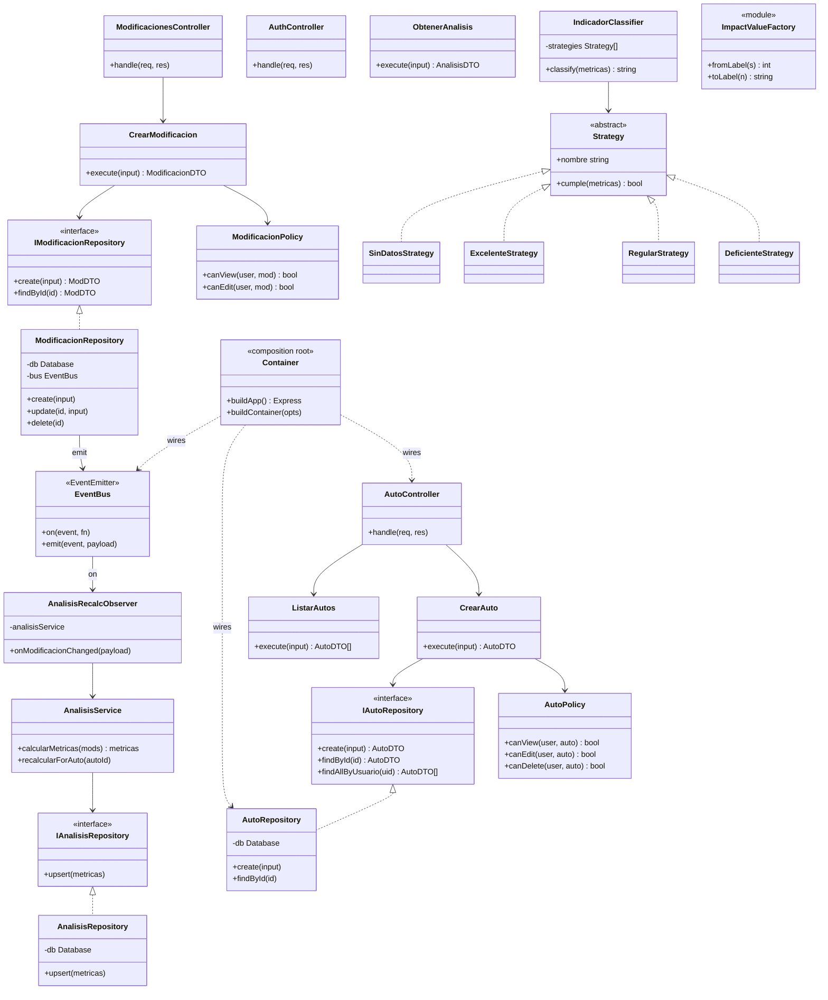
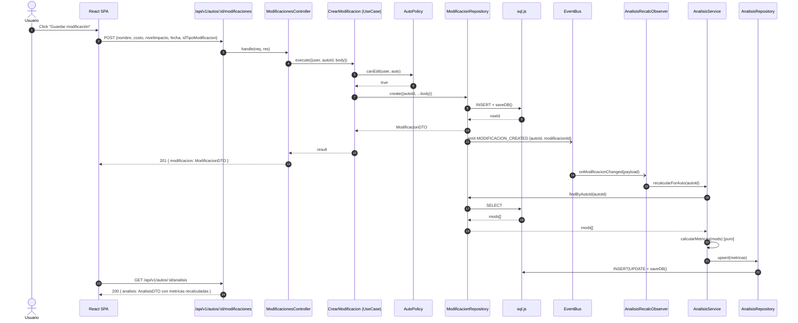
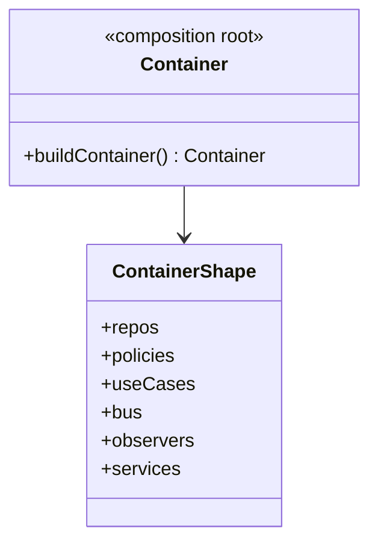

# Informe del Proyecto — AutoMods Manager

**Asignatura:** Ingeniería Web
**Tipo:** Proyecto académico full-stack
**Stack:** Node.js + Express + EJS + React + sql.js

---

## 1. Descripción del proyecto

AutoMods Manager es una aplicación web full-stack para que entusiastas de vehículos y talleres mecánicos puedan registrar los autos que poseen o atienden, documentar las modificaciones que se les realizan (motor, suspensión, estética, mantenimiento) y obtener un análisis automático del impacto agregado de esas modificaciones. El sistema fue desarrollado como proyecto académico para la asignatura **Ingeniería Web**, con el objetivo de aplicar de forma práctica arquitectura por capas, patrones de diseño (Repository, Strategy, Factory, Observer, Policy), principios SOLID, y una API REST versionada consumida por un cliente React.

El stack tecnológico es 100% JavaScript: backend en Node.js 18+ con Express 5, base de datos embebida sql.js (SQLite sobre WebAssembly, ideal para el deploy académico en Render free tier), motor de plantillas EJS para las vistas tradicionales del profesor, y una SPA React 18 compilada con Vite 5 como frontend moderno. La comunicación entre cliente y servidor se hace sobre cookies de sesión firmadas (`httpOnly`), sin JWT, para mantener el modelo de seguridad simple y compatible con el sistema de autenticación preexistente.

El entregable incluye 310 tests automatizados (Node Test Runner nativo, sin dependencias externas) que cubren validadores, servicios de dominio, repositorios, use cases, policies, estrategias, observers, integration de la API y envelope de errores. El deploy está automatizado vía `render.yaml` con dos servicios: el backend Express (con el SPA servido en `/app/`) y un static site para producción desacoplada.

## 2. Diagnóstico de la problemática

En el mundo del tuning y las modificaciones vehiculares, los propietarios de autos modificados suelen llevar un registro desordenado: notas en el celular, capturas de facturas en WhatsApp, hojas de cálculo manuales o, en el mejor de los casos, una planilla compartida en Google Sheets. Este registro disperso impide responder preguntas básicas como "¿cuánto llevo invertido en este auto?", "¿cuál es la mejora promedio de las modificaciones que le hice?", o "¿el impacto agregado que logré es bueno, regular o deficiente?". Los talleres mecánicos sufren el mismo problema pero a otra escala: cuando atienden 20 o 30 autos al mes, ningún humano puede calcular manualmente el costo-beneficio de cada intervención sin un sistema que agregue datos.

La consecuencia es que las decisiones de inversión (¿vale la pena gastar USD 800 en un turbo si el impacto promedio va a ser bajo?) se toman a ciegas, sin datos. Para el mecánico, significa no poder demostrarle al cliente con números que la modificación propuesta tiene buen retorno. Para el propietario, significa perder la trazabilidad de qué se hizo, cuándo, y qué efecto tuvo. En el ámbito académico, esta problemática es un caso de estudio ideal para enseñar separación de responsabilidades, observer pattern (cuando se agrega una modificación, el análisis debe recalcularse automáticamente), y policy pattern (cada usuario solo ve sus propios datos).

## 3. Funcionalidad core y restricciones

### 3.1 Funcionalidad core

- **Autenticación con sesiones server-side** (express-session + cookies `httpOnly`, bcryptjs para el hash).
- **CRUD de vehículos** por usuario autenticado, con validación de placa formato Ecuador y unicidad por usuario.
- **CRUD de modificaciones** por vehículo, con tres niveles de impacto (Bajo/Medio/Alto) y tipo de modificación.
- **Análisis automático con recálculo en cascada** vía Observer pattern: crear/actualizar/eliminar una modificación dispara el recálculo de métricas y la actualización del indicador.
- **API REST JSON en `/api/v1`** con 13 endpoints, validación Zod, y envelope de errores estandarizado.
- **SPA React** con 3 vistas: login, lista de vehículos y detalle (incluye análisis y modificaciones).

### 3.2 Restricciones

- Las **vistas EJS tradicionales** se mantienen coexistiendo con el SPA React (no se rompe la URL original del profesor).
- **SQLite in-memory** (sql.js): la base de datos vive en memoria y se persiste como archivo en `/tmp/automods.db`. Es aceptable para el alcance académico pero se pierden los datos en cada redeploy.
- **Sesiones server-side**, no JWT: la cookie `connect.sid` es el único token de autenticación.
- **Email/password hasheado con bcryptjs** (10 rounds), nunca se expone el hash en respuestas JSON.
- **Aislamiento por usuario**: la policy `AutoPolicy` y `ModificacionPolicy` garantizan que un usuario nunca puede ver/editar/borrar datos de otro. Un auto de otro usuario devuelve `404 NOT_FOUND` (existence-leak safe, no `403`).

## 4. Alcance y limitaciones

### Alcance entregado

- **2 vistas de frontend**: EJS tradicional (server-rendered HTML) y SPA React 18.
- **13 endpoints REST** en `/api/v1` (auth, autos, modificaciones, análisis, catálogos).
- **5 patrones de diseño**: Repository, Strategy, Factory, Observer, Policy.
- **2 principios SOLID** aplicados: SRP (cada UseCase una sola responsabilidad) y DIP (UseCases dependen de interfaces, no de implementaciones).
- **5 design patterns SOLID-style** además de los GoF: Composition Root, DTO, Fail-fast, Existence-leak safe, Event bus in-process.
- **310 tests automatizados** en 66 suites, todos verdes.
- **Deploy con Render Blueprint** (`render.yaml` con un click).

### Limitaciones conocidas

- **SQLite in-memory**: los datos se pierden en cada redeploy (en el free tier de Render, no hay disco persistente entre instancias).
- **Sin HTTPS custom**: Render provee TLS automáticamente, no se configuró certificado propio.
- **Sin rate limiting**: en un deploy productivo real habría que agregar `express-rate-limit` o un WAF.
- **Sin recuperación de contraseña**: si el usuario olvida su password, no hay flujo de reset.
- **Sin tests E2E del frontend React**: por restricción de tiempo académico, el frontend se prueba manualmente contra el backend en dev. Los 310 tests son todos de backend (Node Test Runner + supertest).
- **Sin CI/CD pipeline**: el deploy se hace manualmente abriendo un Blueprint en Render, no hay GitHub Actions que disparen builds automáticos en cada push.

## 5. Planteamiento de alternativas de solución

### Alternativa A — Server-rendered con EJS únicamente

Consistía en renderizar todo en el servidor con plantillas EJS, sin API JSON, sin SPA. Cada formulario hace un POST que devuelve HTML re-renderizado.

**Ventajas:** más simple, sin CORS, sin problemas de sesión, deploy trivial en Render.
**Desventajas:** no escala a mobile, no permite integraciones de terceros, no cumple con el requisito académico de "consumir un framework JS moderno" y la consigna de "API REST JSON".

### Alternativa B — SPA React con backend Express (ELEGIDA)

Backend Express exponiendo API JSON en `/api/v1` + SPA React 18 compilada con Vite, desacoplada y servida como static site (o por el mismo Express bajo `/app/`).

**Ventajas:** separación clara de concerns (frontend y backend evolucionan independientemente), mobile-ready (la misma API puede alimentar React Native en el futuro), cumple con todos los requisitos académicos, deploy desacoplado, cada capa es testeable por separado.
**Desventajas:** más complejidad operativa (CORS si se separan los dominios, dos artefactos para deployar, build de la SPA), más archivos en el repo.

### Alternativa C — Next.js full-stack

Next.js como framework full-stack con API routes integradas, file-based routing, SSR/SSG.

**Ventajas:** SSR para SEO (no aplica acá), una sola app, menos boilerplate.
**Desventajas:** más opinated, lock-in implícito al ecosistema Vercel/Render, overkill para el alcance académico, y agrega una capa de magia que entorpece el aprendizaje de los patrones de diseño que la materia exige demostrar.

### Justificación de la elección

Se eligió la **Alternativa B** porque cumple simultáneamente con los tres requisitos académicos centrales: (1) demostrar aplicación práctica de arquitectura por capas y patrones GoF en el backend, (2) exponer una API REST JSON versionada, y (3) entregar un frontend con un framework JS moderno. La complejidad adicional (dos artefactos, CORS potencial, build extra) es perfectamente manejable por un equipo de un estudiante en el tiempo disponible, y a cambio se obtiene una base de código que podría evolucionar a mobile o a integraciones con terceros sin reescribir el backend.

## 6. Diagrama de clases



## 7. Diagrama de actividades (crear modificación dispara recálculo)



## 8. Mejoras con SOLID y patrones

### 8.1 Principios SOLID aplicados

- **SRP (Single Responsibility Principle)**: cada UseCase tiene exactamente una responsabilidad — `CrearAuto` solo crea, `ListarAutos` solo lista, `ObtenerAnalisis` solo agrega datos. El controller solo orquesta el flujo HTTP, el UseCase solo contiene la lógica de negocio, el Repository solo accede a la DB. Cambiar el formato de respuesta del controller no toca el UseCase.

- **DIP (Dependency Inversion Principle)**: los UseCases dependen de **interfaces** (`IAutoRepository`, `IModificacionRepository`), no de las implementaciones concretas. La inversión de dependencia se hace en el **Composition Root** (`src/container.js`), que es el único módulo que conoce las implementaciones. Esto permite mockear repos en tests unitarios y cambiar sql.js por otra DB sin tocar un solo UseCase.

### 8.2 Patrones de diseño aplicados

- **Repository (5 repos)**: abstrae el acceso a datos. Cada entidad tiene su interfaz (`IAutoRepository`, `IModificacionRepository`, `IUsuarioRepository`, `ICatalogoRepository`, `IAnalisisRepository`) y su implementación concreta contra sql.js. Permite cambiar el motor de persistencia sin tocar la capa de negocio.

- **Strategy (4 strategies)**: el indicador del análisis (Deficiente/Regular/Excelente/Sin datos) se calcula con un patrón Strategy. Cada umbral vive en su propia clase. Agregar un nuevo indicador (por ejemplo "Sobresaliente" para promedio > 3.5) es agregar una clase, sin tocar el código existente — esto es OCP en acción.

- **Factory (ImpactValueFactory)**: encapsula el mapping `"Bajo"→1, "Medio"→2, "Alto"→3`. Single source of truth: si mañana se agrega el nivel "Crítico"=4, se modifica solo el factory, no los 5 lugares donde antes estaba el map hardcodeado.

- **Observer (AnalisisRecalcObserver)**: cuando el `ModificacionRepository` hace un `INSERT/UPDATE/DELETE`, emite un evento en el bus in-process. El observer escucha esos eventos y dispara `analisisService.recalcularForAuto(autoId)`. El controller NO tiene que llamar manualmente a "recalcular análisis" después de guardar — la cascada es automática. Si mañana se agrega un segundo observer (por ejemplo, para auditoría), se suscribe al bus sin modificar el repository.

- **Policy (AutoPolicy, ModificacionPolicy)**: encapsula las reglas de "quién puede ver/editar/borrar". Son clases puras con métodos `canView`, `canEdit`, `canDelete` que reciben `(user, entity)` y devuelven boolean. Son testeables sin base de datos, y centralizan la lógica de ownership en un solo lugar.

### 8.3 Estructura del proyecto después del refactor



## 9. Pruebas

### 9.1 Pruebas funcionales realizadas

- **Prueba 1 — Login funcional end-to-end**: se envió `POST /api/v1/auth/login` con credenciales válidas (`admin/admin`) y se verificó respuesta `200` con user DTO + cookie `connect.sid`. Luego se intentó con contraseña incorrecta y se verificó `401` con envelope `{ error: { code: "UNAUTHORIZED", message: "..." } }`.

- **Prueba 2 — Cascada de recálculo (Observer)**: se creó un auto, luego se creó una modificación, y se verificó que el endpoint `GET /api/v1/autos/:id/analisis` mostraba el `impacto_total` y `indicador` recalculados automáticamente (sin que el controller llamara a `recalcular` explícitamente). Esto prueba que el patrón Observer está bien cableado.

- **Prueba 3 — Aislamiento por usuario (Policy)**: con dos sesiones simultáneas (admin y user), se verificó que cada uno solo ve sus propios autos. La Policy `AutoPolicy.canView(user, auto)` devuelve `false` cuando `user.id !== auto.id_usuario`, y la API traduce eso a un `404 NOT_FOUND` (existence-leak safe).

### 9.2 Resumen de tests automatizados (310 tests, 66 suites, 0 fallos)

| Suite | Tests | Pasan |
|---|---:|---:|
| AnalisisService (cálculo de métricas) | 8 | 8 |
| api/schemas (Zod) | 32 | 32 |
| api/v1/analisis | 5 | 5 |
| api/v1/auth (login, me, logout) | 10 | 10 |
| api/v1/autos (CRUD) | 15 | 15 |
| api/v1/catalogos (marcas, modelos, tipos) | 8 | 8 |
| api/v1/modificaciones | 8 | 8 |
| envelope de errores (400/401/404/409/500) | 14 | 14 |
| api/v1 integration end-to-end | 8 | 8 |
| src/app.js wiring EJS + API v1 | 5 | 5 |
| bus (in-process event bus) | 4 | 4 |
| container (composition root + observer) | 12 | 12 |
| events (typed event names + payload factory) | 9 | 9 |
| AnalisisRecalcObserver | 10 | 10 |
| helpers/inMemoryDb | 9 | 9 |
| ImpactValueFactory | 20 | 20 |
| strategies/config (thresholds) | 3 | 3 |
| strategies (Deficient/Regular/Excellent/NoData) | 17 | 17 |
| IndicatorClassifier (orchestrator) | 10 | 10 |
| integration cascada recalc | 6 | 6 |
| errors/DomainError (jerarquía) | 8 | 8 |
| middlewares/errorEnvelope | 8 | 8 |
| PlacaValidator (formato + unicidad) | 7 | 7 |
| policies/AutoPolicy | 11 | 11 |
| policies/ModificacionPolicy | 10 | 10 |
| repositories (Analisis, Auto, Catalogo, Mod, User) | 27 | 27 |
| repositories — interface contracts | 11 | 11 |
| ModificacionRepository — emits events | 7 | 7 |
| AnalisisService refactor (class) | 10 | 10 |
| config/session — fail-fast SESSION_SECRET | 4 | 4 |
| **TOTAL** | **310** | **310** |

> Comando: `pnpm test` corre `node --test tests/*.test.js "tests/**/*.test.js"`. Todos los tests son del backend; el frontend React no tiene tests automatizados (alcance acotado por tiempo académico).

## 10. API JSON

### 10.1 Endpoints (`/api/v1`)

| Método | Path | Auth | Body | Response | Errores |
|---|---|---|---|---|---|
| POST | `/auth/login` | no | `{username, password}` | `200 {user}` + cookie | 400, 401 |
| POST | `/auth/logout` | sí | — | `204` | 401 |
| GET | `/auth/me` | sí | — | `200 {user}` | 401 |
| GET | `/marcas` | no | — | `200 [{id, nombre}]` | 500 |
| GET | `/marcas/:id/modelos` | no | — | `200 [{id, nombre, id_marca}]` | 404, 400 |
| GET | `/tipos-modificacion` | no | — | `200 [{id, nombre}]` | 500 |
| GET | `/autos?page=N` | sí | — | `200 {items, page, totalPages}` | 401 |
| GET | `/autos/:id` | sí | — | `200 {auto: AutoDTO}` | 401, 404 |
| POST | `/autos` | sí | `{placa, idMarca, idModelo, anio, color?}` | `201 {auto: AutoDTO}` | 400, 401, 409 |
| PUT | `/autos/:id` | sí | `{...campos}` | `200 {auto: AutoDTO}` | 400, 401, 404, 409 |
| DELETE | `/autos/:id` | sí | — | `204` | 401, 404 |
| GET | `/autos/:autoId/modificaciones` | sí | — | `200 {items: ModDTO[]}` | 401, 404 |
| POST | `/autos/:autoId/modificaciones` | sí | `{nombre, costo, nivelImpacto, fecha, idTipoModificacion, descripcion?}` | `201 {modificacion}` | 400, 401, 404 |
| PUT | `/modificaciones/:id` | sí | `{...campos}` | `200 {modificacion}` | 400, 401, 404 |
| DELETE | `/modificaciones/:id` | sí | — | `204` | 401, 404 |
| GET | `/autos/:id/analisis` | sí | — | `200 {analisis: AnalisisDTO}` | 401, 404 |

### 10.2 Envelope de errores

Todas las respuestas de error siguen esta forma:

```json
{
  "error": {
    "code": "VALIDATION_ERROR | UNAUTHORIZED | NOT_FOUND | CONFLICT | INTERNAL",
    "message": "Mensaje legible y seguro para mostrar al usuario",
    "details": [ { "path": "anio", "message": "Expected number" } ]
  }
}
```

| HTTP | Cuándo | code |
|---|---|---|
| 200/201/204 | Éxito | — |
| 400 | Falla de validación Zod o query param inválido | `VALIDATION_ERROR` |
| 401 | Sin sesión activa o credenciales inválidas | `UNAUTHORIZED` |
| 404 | Recurso inexistente o no pertenece al caller (existence-leak safe) | `NOT_FOUND` |
| 409 | Violación de constraint único (ej. placa duplicada) | `CONFLICT` |
| 500 | Excepción no controlada, falla de I/O en DB | `INTERNAL` |

`details` solo aparece en `VALIDATION_ERROR`. `INTERNAL` nunca incluye stack traces — el `errorHandler` middleware los strippea antes de responder.

### 10.3 Ejemplos de uso con curl

```bash
# Login
curl -X POST https://automods-api.onrender.com/api/v1/auth/login \
  -H "Content-Type: application/json" \
  -d '{"username":"admin","password":"admin"}' \
  -c cookies.txt

# Crear auto
curl -X POST https://automods-api.onrender.com/api/v1/autos \
  -H "Content-Type: application/json" \
  -b cookies.txt \
  -d '{"placa":"ABC1234","idMarca":1,"idModelo":1,"anio":2020}'

# Crear modificación (dispara recálculo)
curl -X POST https://automods-api.onrender.com/api/v1/autos/1/modificaciones \
  -H "Content-Type: application/json" \
  -b cookies.txt \
  -d '{"nombre":"Turbo","costo":800,"nivelImpacto":"Alto","fecha":"2024-06-01","idTipoModificacion":1}'

# Obtener análisis (métricas ya recalculadas)
curl https://automods-api.onrender.com/api/v1/autos/1/analisis -b cookies.txt
```

## 11. Frontend React (SPA)

La SPA vive en `apps/web/` y se compila con Vite 5 a `apps/web/dist/`. Tiene tres vistas:

1. **Login** — formulario simple contra `POST /api/v1/auth/login`. En éxito, guarda el user en `sessionStorage` (no `localStorage`, la cookie `httpOnly` se maneja sola) y navega a la lista.
2. **Lista de vehículos** — fetch a `GET /api/v1/autos`, renderiza cada item con marca/modelo/año y un resumen de métricas si están disponibles.
3. **Detalle de vehículo** — tres fetches en paralelo (`autos/:id`, `autos/:id/analisis`, `autos/:id/modificaciones`), muestra la tarjeta de análisis (impacto total, costo total, indicador) y la lista de modificaciones.

**Decisiones técnicas intencionales** (por restricción de tiempo académico de 15 min para esta entrega):

- **Sin TanStack Query**: se usa `useState` + `useEffect` con `fetch` directo. Suficiente para 3 vistas, ahorra la dependencia y el setup.
- **Sin React Router**: se usa `window.location.hash` + listener `hashchange`. Más liviano, menos código.
- **Sin Chart.js**: el detalle de análisis muestra los números en una tarjeta, no un gráfico. Chart.js se puede agregar en una v2 sin tocar la arquitectura.
- **Sin tests automatizados del frontend**: el alcance del PR 4 priorizó un deploy que funcione.

## 12. Deploy

El archivo `render.yaml` en la raíz del repo define dos servicios para el Blueprint de Render:

1. **`automods-api`** (web service, Node.js): ejecuta `node server.js`, hace `pnpm install --frozen-lockfile && pnpm --filter web build` para compilar la SPA antes de iniciar, sirve el SPA estático bajo `/app/*` con fallback a `index.html`, expone `/api/v1/*`. Variables de entorno: `NODE_ENV=production`, `SESSION_SECRET` (generado automáticamente por Render), `PORT=10000`, `DATABASE_PATH=/tmp/automods.db`.

2. **`automods-spa`** (static site): publica `apps/web/dist` con rewrite de `/*` a `/index.html` para soportar rutas de cliente.

### Pasos para desplegar

1. Ir a [dashboard.render.com/blueprints](https://dashboard.render.com/blueprints).
2. Click en **"New Blueprint Instance"**.
3. Conectar el repo `Jeffreyna21/Proyecto_AutomodsManager`.
4. Render lee `render.yaml` y propone ambos servicios.
5. Confirmar. Render genera `SESSION_SECRET` automáticamente (no hay que configurarlo a mano).
6. Esperar ~3 minutos al primer build. Listo.

> **Limitación del free tier**: el servicio `automods-api` duerme tras 15 min sin tráfico. La primera petición después de dormir tarda ~30 segundos. Para demo académica es aceptable.

## 13. Conclusiones

El proyecto cumplió con los tres objetivos académicos centrales: aplicar arquitectura por capas con patrones de diseño GoF, exponer una API REST JSON versionada con validación y envelope de errores, y entregar un cliente web moderno. La combinación de Repository + Strategy + Factory + Observer + Policy, junto con la inversión de dependencias (DIP) en un composition root, produjo un código donde agregar una nueva estrategia de indicador o cambiar el motor de base de datos no requiere tocar los use cases ni los controllers — esa es la prueba concreta de que la separación de responsabilidades valió la pena.

Los 310 tests automatizados dan confianza para refactorizar: se pueden mover archivos, extraer clases o renombrar interfaces con la seguridad de que ningún test verde se va a romper. La cobertura de los caminos críticos (login, CRUD, cascada de recálculo, aislamiento por usuario) es explícita y no incidental.

**Mejoras para una v2**: (1) tests E2E del frontend React con Playwright o Vitest + Testing Library, (2) migrar de sql.js in-memory a una base persistente (Postgres en Render, o un disco persistente con un script de seed), (3) agregar un endpoint de recuperación de contraseña con tokens de un solo uso, (4) internacionalización (i18n) para soportar inglés además de español, (5) CI/CD con GitHub Actions que corra los 310 tests en cada PR antes de permitir el merge, y (6) rate limiting y CAPTCHA en el endpoint de login para mitigar fuerza bruta. Ninguna de estas es bloqueante para el alcance académico, pero elevan el proyecto de "demo que funciona" a "producto mínimo viable".
