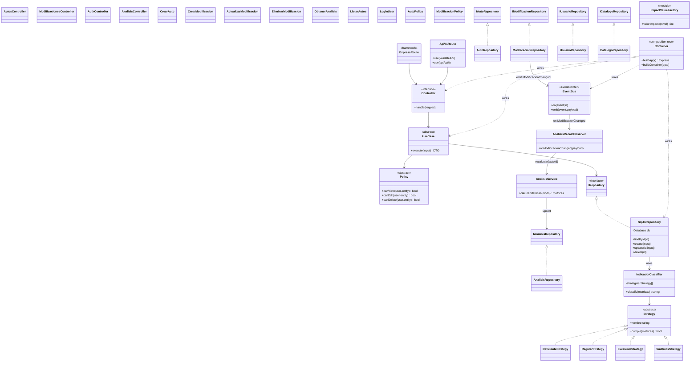
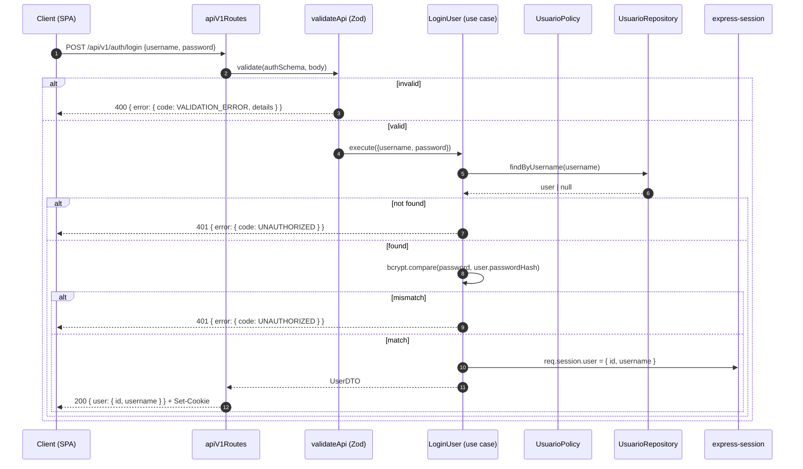
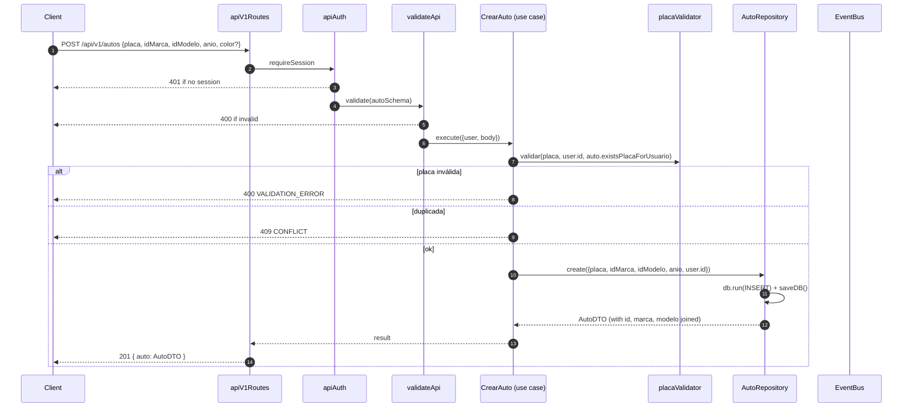
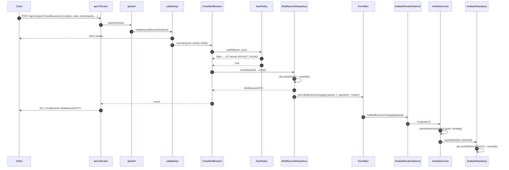
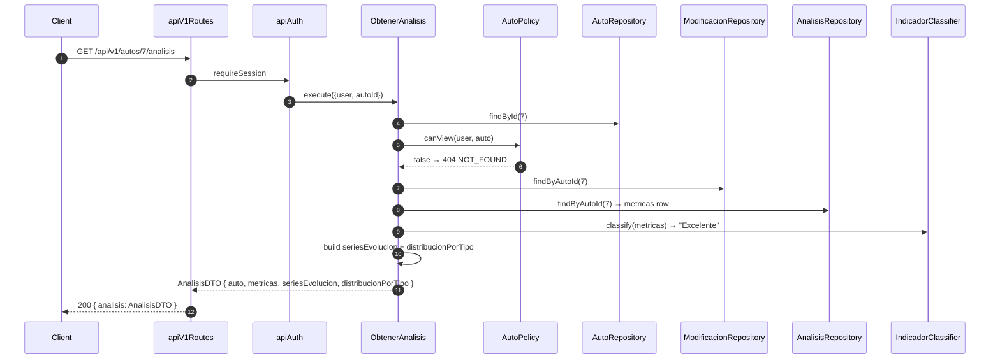
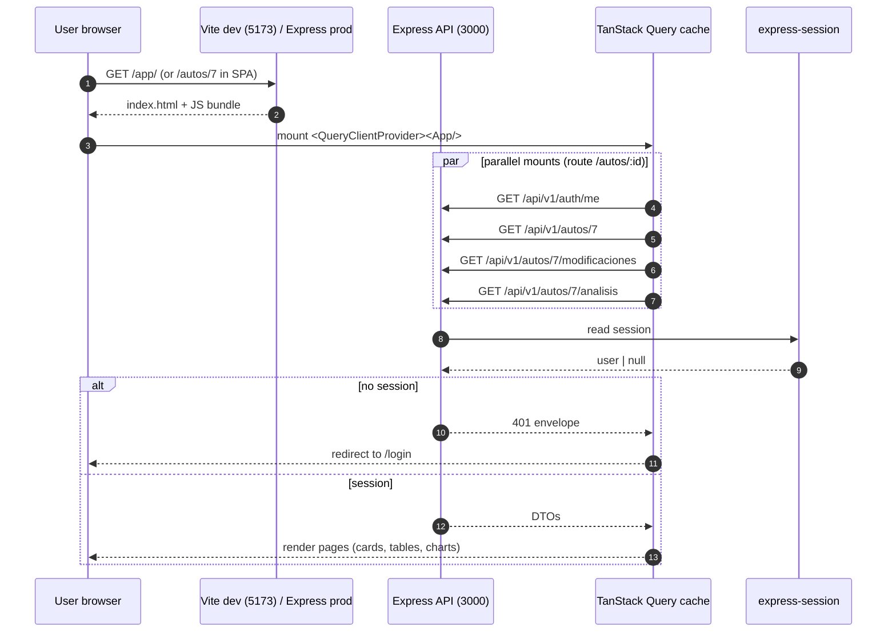
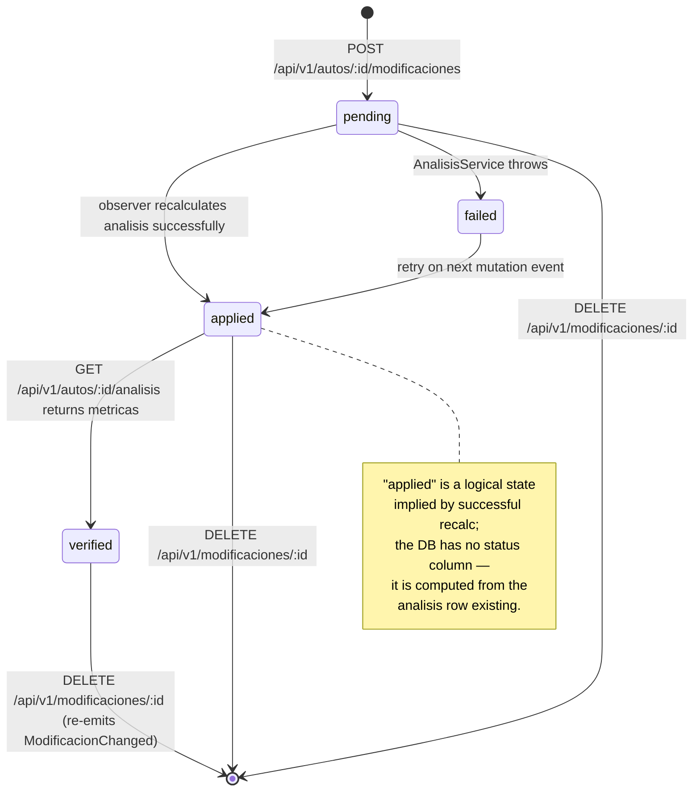

# Design: refactor-api-frontend

> Technical design for the AutoMods Manager refactor + JSON API + React SPA
> + Render deploy. Aligns with `proposal.md`, the 7 delta specs under
> `specs/`, and the `architecture-layered` dependency-direction contract.
> Strict TDD: every layer ships with `node:test` coverage.

## 1. Context

This is an academic project (AutoMods Manager, `proyecto_automodsmanager`):
a working Node.js 18 + Express 5 + EJS + sql.js CRUD with auth, two
aggregated entities (autos / modificaciones), and a recalculated analysis
service. The original MVC stays in production. We are adding a **layered
architecture on the backend** (Repository / Strategy / Factory / Observer /
Policy + use-cases + composition root), a **full versioned JSON API at
`/api/v1`**, and a **React SPA** in a new `apps/web` workspace, all
deployed via a **Render blueprint** with two services (web + static). The
EJS views and session cookie are preserved. Five chained PRs (Foundation
→ Patterns → API → Frontend → Verify) keep every diff under the 400-line
review budget.

## 2. File Layout (new tree)

> Legend: `=` unchanged, `~` modified, `+` new, `-` deleted. Grouped
> visually: backend (`src/`) and frontend (`apps/web/`).

```
proyecto_automodsmanager/
├── openspec/                                = (change folder already exists)
├── database/                                = (sql.js file store, untouched)
├── public/                                  = (CSS + dropdown JS, untouched)
├── tests/                                   ~ expanded 15 → 60+ tests
│   ├── helpers/
│   │   └── inMemoryDb.js                    +  fresh `new SQL.Database()` per suite
│   ├── repositories/                        +  per-repo tests
│   ├── policies/                            +  per-policy tests
│   ├── indicators/                          +  strategy + factory tests
│   ├── usecases/                            +  per-use-case tests
│   ├── api/                                 +  supertest tests for /api/v1
│   ├── observers/                           +  bus wiring tests
│   ├── analisisService.test.js              =  (kept, still tests pure calcs)
│   └── placaValidator.test.js               =
├── src/
│   ├── app.js                               ~ delegates to container.buildApp()
│   ├── container.js                         +  composition root
│   ├── bus.js                               +  in-process EventEmitter wrapper
│   ├── config/
│   │   └── session.js                       ~ fail-fast when NODE_ENV=production && !SESSION_SECRET
│   ├── models/
│   │   ├── db.js                            =  (still used by repos; receives injected handle)
│   │   ├── autoModel.js                     -  replaced by AutoRepository
│   │   ├── modificacionModel.js             -  replaced by ModificacionRepository
│   │   ├── usuarioModel.js                  =  (kept; UsuarioRepository wraps it)
│   │   └── catalogoModel.js                 =  (kept; CatalogoRepository wraps it)
│   ├── repositories/                        +  one per entity (interface + impl)
│   │   ├── IAutoRepository.js
│   │   ├── AutoRepository.js
│   │   ├── IModificacionRepository.js
│   │   ├── ModificacionRepository.js
│   │   ├── IUsuarioRepository.js
│   │   ├── UsuarioRepository.js
│   │   ├── ICatalogoRepository.js
│   │   ├── CatalogoRepository.js
│   │   ├── IAnalisisRepository.js
│   │   └── AnalisisRepository.js
│   ├── domain/                              +  patterns
│   │   ├── strategies/
│   │   │   ├── IndicadorClassifier.js
│   │   │   ├── DeficienteStrategy.js
│   │   │   ├── RegularStrategy.js
│   │   │   ├── ExcelenteStrategy.js
│   │   │   ├── SinDatosStrategy.js
│   │   │   └── config.js
│   │   ├── factories/
│   │   │   └── impactoValues.js
│   │   ├── events/
│   │   │   └── events.js                    (event-name constants)
│   │   └── observers/
│   │       └── AnalisisRecalcObserver.js
│   ├── usecases/                            +  thin orchestration
│   │   ├── auth/loginUser.js
│   │   ├── auth/logoutUser.js
│   │   ├── autos/crearAuto.js
│   │   ├── autos/actualizarAuto.js
│   │   ├── autos/eliminarAuto.js
│   │   ├── autos/obtenerAuto.js
│   │   ├── autos/listarAutos.js
│   │   ├── modificaciones/crearModificacion.js
│   │   ├── modificaciones/actualizarModificacion.js
│   │   ├── modificaciones/eliminarModificacion.js
│   │   └── analisis/obtenerAnalisis.js
│   ├── policies/                            +  ownership checks
│   │   ├── AutoPolicy.js
│   │   └── ModificacionPolicy.js
│   ├── dtos/                                +  shape for JSON responses
│   │   ├── AutoDTO.js
│   │   ├── ModificacionDTO.js
│   │   ├── AnalisisDTO.js
│   │   └── UserDTO.js
│   ├── validators/                          +  Zod schemas for /api/v1
│   │   ├── autoSchema.js
│   │   ├── modificacionSchema.js
│   │   └── authSchema.js
│   ├── controllers/                         ~  thinned (~10 lines / handler)
│   │   ├── authController.js
│   │   ├── autosController.js
│   │   └── modificacionesController.js
│   ├── middlewares/
│   │   ├── authMiddleware.js                =
│   │   ├── validationMiddleware.js          =  (kept for EJS routes only)
│   │   ├── apiAuth.js                       +  JSON-friendly requireAuth (returns 401 envelope)
│   │   ├── validateApi.js                   +  Zod runner producing 400 envelope
│   │   └── errorHandler.js                  +  final 500 envelope, no stack leak
│   ├── routes/
│   │   ├── authRoutes.js                    =  (EJS)
│   │   ├── autosRoutes.js                   =  (EJS)
│   │   ├── modificacionesRoutes.js          =  (EJS)
│   │   ├── apiRoutes.js                     -  replaced by apiV1Routes
│   │   └── apiV1Routes.js                   +  mounted at /api/v1
│   ├── services/
│   │   ├── placaValidator.js                =
│   │   └── analisisService.js               ~  only `calcularMetricas` (pure); persist → AnalisisRepository
│   └── views/                               =  (UNTOUCHED; analisis.ejs drops inline map in 3rd PR)
├── apps/
│   └── web/                                 +  Vite + React 18 + TanStack Query v5 SPA
│       ├── package.json                     +
│       ├── vite.config.ts                   +
│       ├── index.html                       +
│       ├── tsconfig.json                    +
│       ├── vitest.config.ts                 +
│       ├── src/
│       │   ├── main.tsx                     +
│       │   ├── App.tsx                      +
│       │   ├── router.tsx                   +
│       │   ├── api/
│       │   │   ├── client.ts                +  fetch wrapper, credentials: 'include'
│       │   │   └── hooks.ts                 +  TanStack Query keys + useXxx hooks
│       │   ├── auth/
│       │   │   └── AuthProvider.tsx         +
│       │   ├── pages/
│       │   │   ├── LoginPage.tsx            +
│       │   │   ├── AutosListPage.tsx        +
│       │   │   ├── AutoDetailPage.tsx       +
│       │   │   ├── ModificacionesPage.tsx   +
│       │   │   └── AnalisisPage.tsx         +
│       │   └── components/                  +  Cards, Tables, Forms, Chart wrappers
│       └── tests/                           +  vitest + @testing-library/react
├── server.js                                =  (unchanged contract; awaits container)
├── render.yaml                              +  blueprint: web + static
├── package.json                             ~  +zod, +supertest, scripts for web
├── pnpm-workspace.yaml                      ~  adds `apps/web`
├── deploy.md                                ~  new env vars, SPA build, /app/ URL
└── README.md                                ~  deploy instructions + SPA section
```

## 3. Class Diagram



## 4. Sequence Diagrams

### 4.1 Login flow — `POST /api/v1/auth/login`



### 4.2 Create auto — `POST /api/v1/autos`



### 4.3 Create modification (Observer fires) — `POST /api/v1/autos/:id/modificaciones`



### 4.4 Get analysis — `GET /api/v1/autos/:id/analisis`



### 4.5 Frontend dashboard load



## 5. State Diagram — Modificación lifecycle



> The DB schema is unchanged (`modificaciones` has no `status` column);
> `pending → applied → verified` is a computed lifecycle driven by the
> presence/absence of the `analisis` row and its `updated_at` timestamp.
> This is documented in `pattern-observer/spec.md` to avoid future confusion.

## 6. Data Flow — request lifecycle through new layers

```mermaid
flowchart TD
  REQ[HTTP request] --> MW[Global middlewares<br/>json, session, flash]
  MW --> AUTH[apiAuth / requireAuth]
  AUTH -->|no session| E401[401 envelope]
  AUTH -->|session| VAL[validateApi Zod]
  VAL -->|invalid| E400[400 envelope]
  VAL --> ROUTE[apiV1Routes handler]
  ROUTE --> CTRL[Controller<br/>~10 lines]
  CTRL --> UC[Use case<br/>orchestrate]
  UC --> POL[Policy<br/>canEdit/canView]
  POL -->|denied| E404[404 envelope<br/>existence-leak safe]
  POL -->|allowed| REPO[Repository<br/>DIP, returns DTO]
  REPO --> DB[(sql.js Database)]
  REPO -->|persist ok| BUS{emit event?}
  BUS -->|ModificacionChanged| OBS[AnalisisRecalcObserver]
  OBS --> SVC[AnalisisService<br/>calcularMetricas pure]
  SVC --> CLF[IndicadorClassifier<br/>Strategy]
  CLF --> ST[Deficiente/Regular/Excelente]
  SVC --> ARO[AnalisisRepository.upsert]
  BUS --> DONE[Use case returns DTO]
  ARO --> DONE
  REPO --> DONE
  DONE --> DTO[DTO mapper]
  DTO --> RES[res.status(200/201/204).json]
  E401 --> ERH[errorHandler middleware]
  E400 --> ERH
  E404 --> ERH
  RES --> EH[errorHandler<br/>catches unhandled → 500 INTERNAL]
  EH --> CLIENT[Client]
  ERH --> CLIENT
```

## 7. JSON API Contract

> All endpoints under `/api/v1`. Auth = same `express-session` cookie the
> EJS app sets; no token, no `Authorization` header required. Errors use
> the envelope in §7.2. Body validation runs **before** the controller
> via `validateApi(schema)`.

### 7.1 Endpoints

| Method | Path | Auth | Request body | Success response | Error codes |
|---|---|---|---|---|---|
| POST | `/api/v1/auth/login` | no | `{ username: string, password: string }` | `200 { user: { id, username } }` + `Set-Cookie` | 400, 401 |
| POST | `/api/v1/auth/logout` | yes | — | `204` | 401 |
| GET | `/api/v1/auth/me` | yes | — | `200 { user: { id, username } }` | 401 |
| GET | `/api/v1/marcas` | **no** | — | `200 [{ id, nombre }]` | 500 |
| GET | `/api/v1/marcas/:id/modelos` | **no** | — | `200 [{ id, nombre, id_marca }]` | 404 |
| GET | `/api/v1/tipos-modificacion` | **no** | — | `200 [{ id, nombre }]` | 500 |
| GET | `/api/v1/autos?page=N` | yes | — | `200 { items: AutoDTO[], page, totalPages }` | 401 |
| GET | `/api/v1/autos/:id` | yes | — | `200 { auto: AutoDTO }` | 401, 404 |
| POST | `/api/v1/autos` | yes | `{ placa, idMarca, idModelo, anio, color? }` | `201 { auto: AutoDTO }` | 400, 401, 409 |
| PUT | `/api/v1/autos/:id` | yes | `{ placa, idMarca, idModelo, anio, color? }` | `200 { auto: AutoDTO }` | 400, 401, 404, 409 |
| DELETE | `/api/v1/autos/:id` | yes | — | `204` | 401, 404 |
| GET | `/api/v1/autos/:autoId/modificaciones` | yes | — | `200 { items: ModificacionDTO[] }` | 401, 404 |
| POST | `/api/v1/autos/:autoId/modificaciones` | yes | `{ nombre, descripcion?, costo, nivelImpacto, fecha, idTipoModificacion }` | `201 { modificacion: ModificacionDTO }` | 400, 401, 404 |
| PUT | `/api/v1/modificaciones/:id` | yes | same shape as create | `200 { modificacion: ModificacionDTO }` | 400, 401, 404 |
| DELETE | `/api/v1/modificaciones/:id` | yes | — | `204` | 401, 404 |
| GET | `/api/v1/autos/:id/analisis` | yes | — | `200 { analisis: AnalisisDTO }` | 401, 404 |

### 7.2 Error envelope

```json
{
  "error": {
    "code": "VALIDATION_ERROR | NOT_FOUND | CONFLICT | UNAUTHORIZED | INTERNAL",
    "message": "Human-readable, safe to display.",
    "details": [ { "path": "anio", "message": "Expected number" } ]
  }
}
```

`details` is present only on `VALIDATION_ERROR`. `INTERNAL` never carries
`details` and never includes stack traces (`errorHandler.js` strips them).

### 7.3 Status code conventions

| Code | When | Envelope code |
|---|---|---|
| 200 | Successful read or update with body | — |
| 201 | Successful create with body | — |
| 204 | Successful create/update/delete with no body | — |
| 400 | Zod validation failure or invalid query param | `VALIDATION_ERROR` |
| 401 | No active session or bad credentials | `UNAUTHORIZED` |
| 404 | Resource missing OR not owned by caller (existence-leak safe) | `NOT_FOUND` |
| 409 | Unique constraint violation (duplicate `placa`) | `CONFLICT` |
| 500 | Unhandled exception, DB I/O failure | `INTERNAL` |

## 8. DTO Mappings

The EJS view contract is preserved **field-for-field** for `autos` and
`analisis`. New fields are additive and never replace existing ones.

### 8.1 `AutoDTO` (used by `/api/v1/autos/*` and preserved for EJS)

```js
// Same shape that `autoModel.getAllByUsuario` returned — see src/models/autoModel.js:16-26
{
  id: row.id,
  placa: row.placa,
  anio: row.anio,
  id_usuario: row.id_usuario,
  created_at: row.created_at,
  marca: row.marca,         // joined from marcas
  modelo: row.modelo,       // joined from modelos
  id_marca: row.id_marca,
  id_modelo: row.id_modelo,
  // NEW (additive, optional in list, present in detail):
  color: row.color,         // nullable, new column not in current schema — see note
  metricas: undefined       // populated only on /api/v1/autos/:id (see 8.2)
}
```

> **Note**: `color` is not in the current `autos` table. The change adds
> `color TEXT NULL` via a one-line `ALTER TABLE` in `db.js` (idempotent
> `try/catch` to handle the existing seed). EJS view is unchanged — it
> simply ignores fields it doesn't read. The detail DTO adds `metricas`
> only for `/api/v1/autos/:id` (not for the list page) to keep the
> existing `autos/index.ejs` paginated query untouched.

### 8.2 `AutoDetailDTO` (`/api/v1/autos/:id`)

```js
{
  ...AutoDTO,
  metricas: {                    // same shape returned by analisisService.calcularMetricas
    impacto_total: number,
    costo_total: number,
    numero_modificaciones: number,
    promedio_mejora: number | null,
    costo_beneficio: number | null,
    indicador: "Deficiente" | "Regular" | "Excelente" | "Sin datos"
  }
}
```

### 8.3 `ModificacionDTO`

```js
{
  id, nombre, descripcion, costo, nivel_impacto: "Bajo"|"Medio"|"Alto",
  fecha, auto_id, id_tipo_modificacion, created_at, tipo
}
```

> Field names match `modificacionModel.getByAutoId` exactly
> (`src/models/modificacionModel.js:15-26`) so any EJS view that already
> reads `mod.tipo` keeps working.

### 8.4 `AnalisisDTO` (`/api/v1/autos/:id/analisis`)

```js
{
  auto: { id, placa, marca, modelo, anio },            // subset of AutoDTO
  metricas: { impacto_total, costo_total, numero_modificaciones,
              promedio_mejora, costo_beneficio, indicador },
  seriesEvolucion: [                                    // pre-aggregated, no client math
    { fecha: "2024-01-15", impacto_acumulado: 3, costo_acumulado: 1200 }
  ],
  distribucionPorTipo: [
    { tipo: "Motor", count: 2, impacto_total: 5 }
  ]
}
```

> The EJS view `src/views/autos/analisis.ejs` previously computed
> `impactoAcumulado` / `conteoTipos` inline (C10) using the duplicated
> `valorImpacto` map (C6). After the change, the view consumes the
> pre-aggregated payload and **stops computing**; the inline map is
> deleted from the view (fixes C6 + C10 by construction).

### 8.5 `UserDTO`

```js
{ id, username }                    // never exposes passwordHash
```

## 9. Event Payloads

The event bus is a single in-process `EventEmitter` exposed as
`container.bus`. The bus surface (`src/bus.js`) wraps the emitter and
re-exports a typed API to keep the test surface stable.

### 9.1 Event names (`src/domain/events/events.js`)

```js
module.exports = Object.freeze({
  MODIFICACION_CREATED: 'modificacion.created',
  MODIFICACION_UPDATED: 'modificacion.updated',
  MODIFICACION_DELETED: 'modificacion.deleted'
});
```

> Note: `pattern-observer/spec.md` calls the aggregate signal
> `ModificacionChanged`. The container registers a single listener
> (`AnalisisRecalcObserver`) on the *net* of the three events above; the
> observer does not care which CRUD verb fired. Internally the repos
> call `bus.emit(MODIFICACION_CREATED | UPDATED | DELETED, payload)`.

### 9.2 Payload shape

```js
// Always: { autoId: number, operation: 'create'|'update'|'delete', modificacionId: number, at: ISODate }
{
  autoId: 7,
  operation: 'create' | 'update' | 'delete',
  modificacionId: 99,
  at: new Date().toISOString()
}
```

### 9.3 Emitters and subscribers

| Event | Emitted by | Subscribers |
|---|---|---|
| `modificacion.created` | `ModificacionRepository.create` after successful `INSERT` + `saveDB()` | `AnalisisRecalcObserver` |
| `modificacion.updated` | `ModificacionRepository.update` after successful `UPDATE` + `saveDB()` | `AnalisisRecalcObserver` |
| `modificacion.deleted` | `ModificacionRepository.delete` after successful `DELETE` + `saveDB()` | `AnalisisRecalcObserver` |

The observer does not catch errors — they propagate to the bus, are
logged by Express' error middleware for API-triggered mutations, and
fail the request. For emit-on-bulk-migration runs the container can be
built with `{ withRecalcObserver: false }` and the recalc can be batched
manually (out of scope for this change).

## 10. Frontend Architecture

### 10.1 Vite config (`apps/web/vite.config.ts`)

```ts
import { defineConfig } from 'vite';
import react from '@vitejs/plugin-react';

export default defineConfig({
  plugins: [react()],
  server: {
    port: 5173,
    proxy: {
      '/api/v1': {                       // no changeOrigin: true (keeps /api/v1 prefix)
        target: 'http://localhost:3000',
        secure: false
      }
    }
  },
  build: {
    outDir: 'dist',
    sourcemap: true
  }
});
```

In dev: Vite serves the SPA at `http://localhost:5173` and proxies
`/api/v1/*` to Express on `:3000` so the same `connect.sid` cookie
travels through and the browser shows it as same-origin.

In prod: Express serves the static build at `/app/*` (see §11.4); the
SPA's `fetch('/api/v1/...')` calls hit the same origin and the cookie
is sent automatically.

### 10.2 Build output

- `apps/web/dist/index.html`
- `apps/web/dist/assets/<hashed>.{js,css}`
- `apps/web/dist/favicon.svg`

### 10.3 AuthProvider (cookie-based, no token)

```ts
// apps/web/src/auth/AuthProvider.tsx
const { data: me } = useQuery({
  queryKey: ['auth', 'me'],
  queryFn: () => api.get('/auth/me').then(r => r.user),
  retry: false,
  staleTime: 60_000
});
// AuthProvider exposes { user, isAuthenticated: !!me } via context
// and renders <Outlet/>; if !me, route guards redirect to /login.
```

No `localStorage`, no `sessionStorage` — the session cookie is
`httpOnly` (set by `src/config/session.js:7`); the SPA only knows the
user identity via `GET /api/v1/auth/me`.

### 10.4 React Router routes

```
/login                 LoginPage
/autos                 AutosListPage           (paginated list)
/autos/:id             AutoDetailPage         (auto + mods + analisis in parallel)
/autos/:id/analisis    AnalisisPage           (dashboard + 3 chart canvases)
/autos/:id/modificar   ModificacionesPage     (create/edit form)
```

Route guards: `<RequireAuth/>` reads `AuthProvider` context and
`<Navigate to="/login" replace/>` on miss.

### 10.5 TanStack Query keys (convention)

```
['auth', 'me']
['autos', { page }]
['autos', id]
['autos', id, 'modificaciones']
['autos', id, 'analisis']
['catalogos', 'marcas']
['catalogos', 'marcas', idMarca, 'modelos']
['catalogos', 'tipos-modificacion']
```

Mutation `onSuccess` invalidates:
- `POST /autos` → `['autos']` (list)
- `POST /autos/:id/modificaciones` → `['autos', id, 'modificaciones']` + `['autos', id, 'analisis']`
- `PUT /modificaciones/:id` → same as above
- `DELETE /autos/:id` → `['autos']` (list)

The `api/client.ts` wrapper does:

```ts
fetch(input, { credentials: 'include', headers: { 'Content-Type': 'application/json' } })
```

so the browser sends `connect.sid` on every request.

## 11. Deploy Plan

### 11.1 `render.yaml` (root)

```yaml
services:
  - type: web
    name: automods-web
    runtime: node
    plan: free
    rootDir: .
    buildCommand: |
      pnpm install --frozen-lockfile &&
      pnpm --filter web build
    startCommand: node server.js
    numInstances: 1
    envVars:
      - key: NODE_ENV
        value: production
      - key: SESSION_SECRET
        sync: false                # set in Render dashboard
      - key: PORT
        value: 10000               # Render-provided; Express binds to process.env.PORT
      - key: DATABASE_PATH
        value: /tmp/automods.db    # sql.js file path; ephemeral on free tier
  - type: static
    name: automods-web-static
    runtime: static
    rootDir: apps/web
    buildCommand: pnpm install --frozen-lockfile && pnpm build
    staticPublishPath: dist
    routes:
      - type: rewrite
        source: /app/*
        destination: /index.html   # SPA fallback
```

### 11.2 Environment variables

| Var | Where set | Required in prod? | Notes |
|---|---|---|---|
| `SESSION_SECRET` | Render dashboard (secret) | **YES** | `src/config/session.js` throws at boot if `NODE_ENV=production` and this is missing (fixes C2). |
| `PORT` | Render auto-injects | n/a | `server.js:5` reads `process.env.PORT`. |
| `NODE_ENV` | `render.yaml` value | YES | Required for the fail-fast check. |
| `DATABASE_PATH` | `render.yaml` value | recommended | sql.js needs a writable file; `/tmp` is ephemeral on free tier — acceptable for academic demo. |
| `VITE_API_URL` | Build-time, default `/api/v1` | optional | The SPA's `api/client.ts` defaults to `/api/v1` (same-origin); override only if you split the static site onto a different host (CORS). |

### 11.3 Build & start commands

- **Web service build**: `pnpm install --frozen-lockfile && pnpm --filter web build` (builds the SPA into `apps/web/dist` so Express can serve it).
- **Web service start**: `node server.js` (binds to `process.env.PORT`).
- **Static site build**: same `pnpm install --frozen-lockfile && pnpm build`; publishes `apps/web/dist`.

### 11.4 Serving the SPA

Two viable topologies; the design **picks option A**:

| Option | How the SPA is served | Trade-off |
|---|---|---|
| **A — same-origin (chosen)** | Express serves `apps/web/dist` under `/app/*` in prod; Vite proxies in dev | One cookie, no CORS, simpler. |
| B — split origin (CORS) | Static site is a separate domain, SPA `fetch` to web service URL with `credentials: 'include'` | Render static sites don't forward cookies; needs CORS preflight + `SameSite=None` cookie. |

For option A, `src/app.js` gains one line **after** the API mount:

```js
app.use('/app', express.static(path.join(__dirname, '../apps/web/dist')));
app.get('/app/*', (req, res) => res.sendFile(path.join(__dirname, '../apps/web/dist/index.html')));
```

`render.yaml` is documented for both — primary: option A.

## 12. Risk Mitigations

| # | Risk | Mitigation |
|---|---|---|
| R1 | `sql.js` is in-memory + `fs.writeFileSync` (single-process; C1) | Acceptable for academic demo deploy on Render free tier; documented in `deploy.md`. Out of scope to fix (no migration framework). |
| R2 | `SESSION_SECRET` leak (C2) | `src/config/session.js` fail-fast: when `NODE_ENV === 'production'` and `!process.env.SESSION_SECRET`, throw a clear error and `process.exit(1)`. Tested by `tests/config/session.test.js` setting env vars. |
| R3 | EJS view coupling (C6, C10) | DTOs preserve the exact field names that `autoModel.getAllByUsuario` and `analisisService.calcularMetricas` produce today. Integration test in `tests/integration/dto-shape.test.js` reads every EJS template and asserts each `auto.<field>` it references is present in the DTO. `analisis.ejs` stops computing and consumes the pre-aggregated payload. |
| R4 | 400-line review budget (D1) | Five chained PRs (Foundation → Patterns → API → Frontend → Verify); orchestrator MUST surface the plan before `sdd-apply`. Each PR's diff is estimated ≤ 350 lines. |
| R5 | Concurrent writes (sql.js + `saveDB()` race) | Documented in `deploy.md:9`; `numInstances: 1` enforced. Out of scope to add a write-lock. The same risk exists in the pre-change code, so the change does not regress. |
| R6 | EJS coexisting with SPA confuses users | `README.md` and `deploy.md` state EJS is the default at `/`, SPA is opt-in at `/app/`. Both consume the same `/api/v1`. |
| R7 | New dep bloat (`zod`, `vite`, `react`, `supertest`, etc.) | All in `package.json` with `^` ranges; `pnpm-lock.yaml` is committed. Chart.js pinned to `^4.4.0` to replace CDN. |
| R8 | Strict TDD churn | Every task ships RED → GREEN → REFACTOR; test count grows 15 → 60+; `tests/*.test.js` count is part of acceptance. |
| R9 | `color` column not in current schema | Idempotent `ALTER TABLE autos ADD COLUMN color TEXT` inside `db.js`, wrapped in `try { db.run(...) } catch (e) { /* already exists */ }`. New column is nullable, so old rows still load. |
| R10 | `getDB()` still module-level inside `db.js` | Repositories accept the `Database` handle in their constructor and **do not call `getDB()`**; `src/container.js` is the only caller. The `getDB()` export remains for backward compatibility with `db.js` seeds but is unused outside the container. |

## 13. Out of Scope

- No JWT, no OAuth, no API tokens. Session cookie only.
- No Redis, no message broker. The event bus is in-process
  `EventEmitter`.
- No Docker image / registry. Render Blueprint deploy only.
- No CI pipeline (no GitHub Actions, no Render previews beyond the
  default).
- No multi-process scaling (`numInstances: 1` is the contract).
- No payments, email, file uploads, or migration framework.
- No TypeScript on the backend (CommonJS only per
  `openspec/config.yaml` `rules.apply`).
- No removal of EJS views or `public/js/*` assets.
- No i18n (the existing Spanish strings remain; no new languages).
- No new business rules beyond what `explore.md` and `proposal.md`
  authorize.

---

## Appendix: Chained PR Plan (cross-reference)

| PR | Group | Scope | Estimated diff |
|---|---|---|---|
| 1 | Foundation | `src/container.js`, `src/bus.js`, 5× repos + interfaces, `policies/`, `tests/helpers/inMemoryDb.js`, fail-fast session secret, re-export shims on `models/*` so old imports keep working, tests | ~300 LOC |
| 2 | Patterns | `domain/strategies/*`, `domain/factories/impactoValues.js`, `domain/observers/AnalisisRecalcObserver.js`, observer registration in container, per-strategy + listener tests | ~250 LOC |
| 3 | API + DTOs | `dtos/*`, `validators/*`, `routes/apiV1Routes.js`, `middlewares/{apiAuth,validateApi,errorHandler}.js`, new controllers `authControllerApi`, etc., `analisis.ejs` consumes pre-aggregated data, supertest tests | ~350 LOC |
| 4 | Frontend | `apps/web/` workspace, `vite.config.ts`, `package.json` + `pnpm-workspace.yaml` updates, 5 pages, AuthProvider, TanStack Query hooks, chart wrappers, vitest tests, `render.yaml` | ~350 LOC |
| 5 | Verify + archive | `node --test` green, smoke every EJS page + every JSON endpoint, update `README.md` + `deploy.md`, `sdd-archive` | ~100 LOC |
